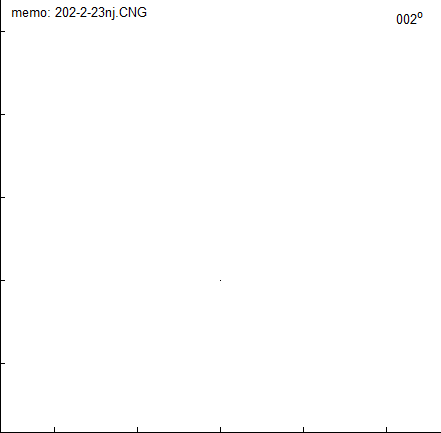

# Compartmental modeling
EN.580.439 Models of the Neuron

## Model details
- Humpback whale cerebellar stellate cell
- Neuromorpho: http://neuromorpho.org/neuron_info.jsp?neuron_name=202-2-23nj

## Topics explored
- Temporal response at the soma to transient inputs applied at different locations within the dendritic tree
- Effectiveness of on-path vs off-path shunting inhibition
- Low pass filtering abilities of the dendritic tree

