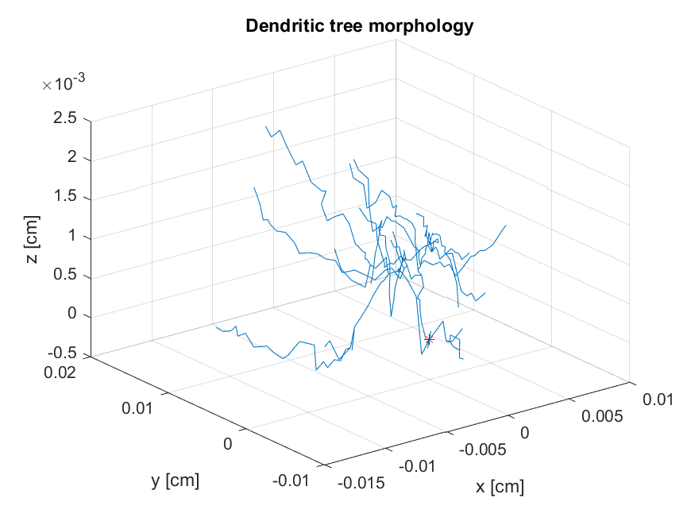

# Compartmental modeling
EN.580.439 Models of the Neuron

## Model details 
- Humpback whale cerebellar stellate cell
- Morphometry data: http://neuromorpho.org/neuron_info.jsp?neuron_name=202-2-23nj

## Topics explored
- Temporal response at the soma to transient inputs applied at different locations within the dendritic tree
- Effectiveness of on-path vs off-path shunting inhibition
- Low pass filtering abilities of the dendritic tree

## Conclusions
- As input distance from the soma increases, the voltage response of the soma to that input decreases and slows
- On-path inhibition is much stronger than off-path, but that effect is blunted by distance between the inhibition and excitation.
- Inhibition that comes just after excitation has the strongest inhibitory effect.
- Dendrites can act as a low pass filter
- Dendritic filtering effects increases as function of distance
